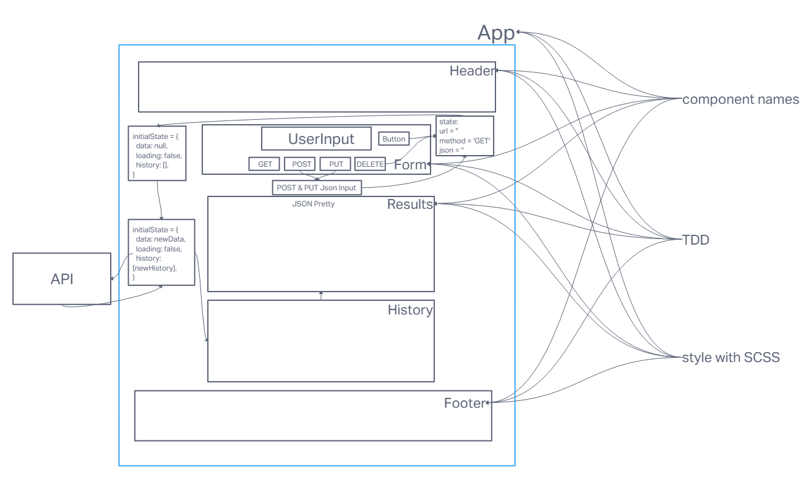
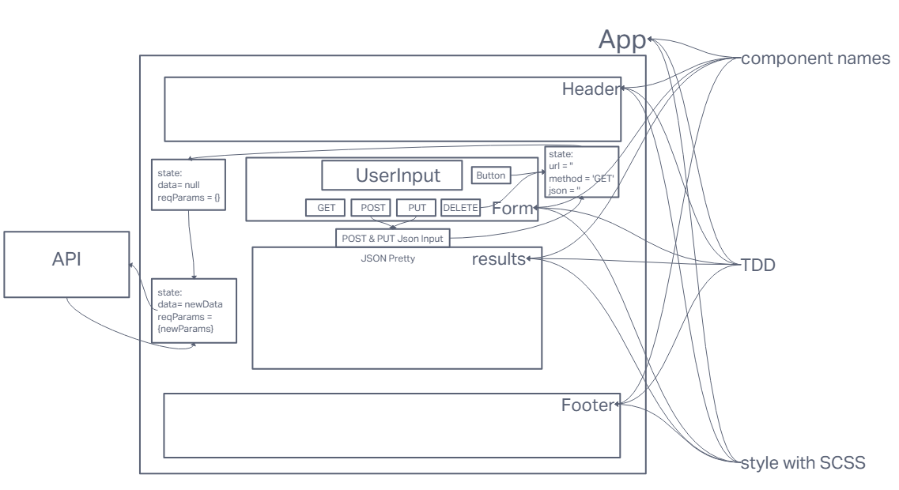
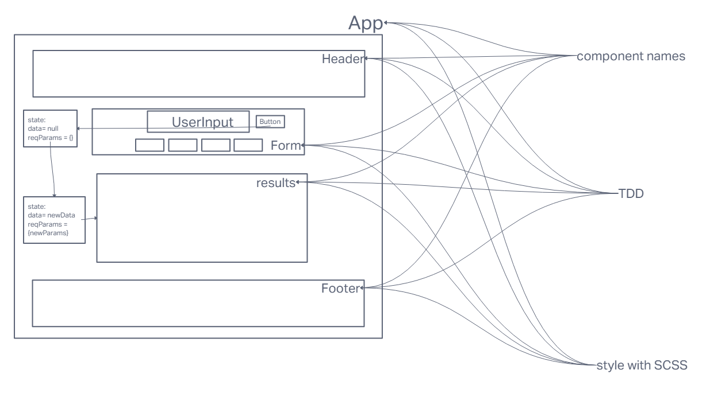
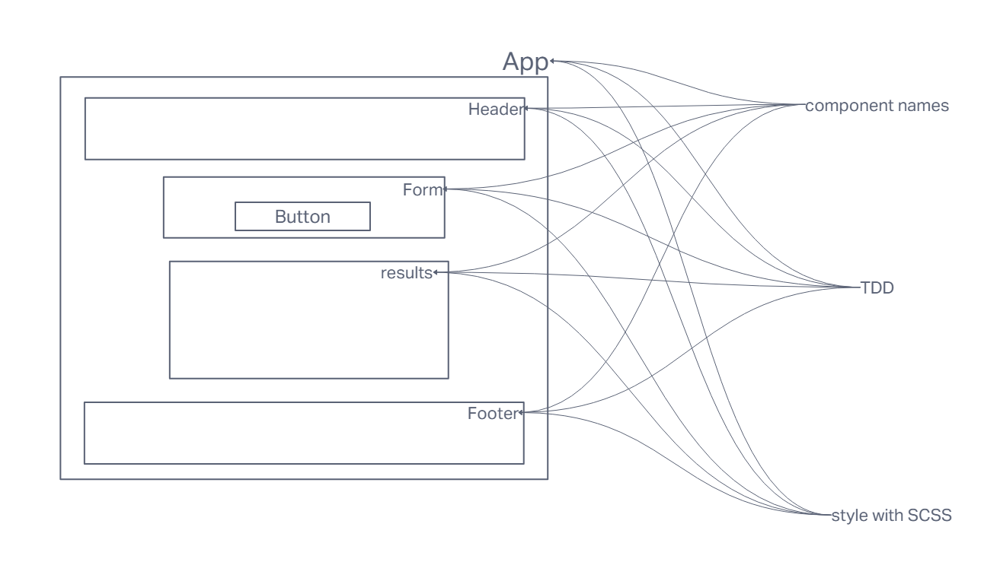

# LAB - Class 26 / 27 / 28 / 29

## Project: RESTy / `useState` Hook / Component LifeCycle / `useEffect` Hook

### Author: Ike Steoger

### Problem Domain  

4-Phase build of the RESTy application, written in React.

- In the 1st phase, our goal is to setup the basic scaffolding of the application, with intent being to add more functionality to the system as we go. This initial build sets up the file structure so that we can progressively build this application in a scalable manner.
- In phase 2, we will be receiving user input in preparation of connecting to live APIs, using the `useState()` hook in our functional components. In order to properly manage state with the `useState` hook, we will now convert `<App />` to a functional component.
- In phase 3, we will be connecting RESTy to live APIs, fetching and displaying remote data. Our primary focus will be to service GET requests.
- In phase 4, we will be tracking every API call and storing it in history.

### Links and Resources

- [GitHub Actions ci/cd](https://github.com/ikesteoger/resty/actions)
<!-- - [back-end server url](http://xyz.com) (when applicable) -->
- [front-end application](https://codesandbox.io/p/github/IkeSteoger/resty/main?layout=%257B%2522sidebarPanel%2522%253A%2522EXPLORER%2522%252C%2522rootPanelGroup%2522%253A%257B%2522direction%2522%253A%2522horizontal%2522%252C%2522type%2522%253A%2522PANEL_GROUP%2522%252C%2522id%2522%253A%2522ROOT_LAYOUT%2522%252C%2522panels%2522%253A%255B%257B%2522type%2522%253A%2522PANEL_GROUP%2522%252C%2522direction%2522%253A%2522horizontal%2522%252C%2522id%2522%253A%2522EDITOR%2522%252C%2522panels%2522%253A%255B%257B%2522type%2522%253A%2522PANEL%2522%252C%2522panelType%2522%253A%2522TABS%2522%252C%2522id%2522%253A%2522clj4xhbws000b356me9orvz6a%2522%257D%255D%252C%2522sizes%2522%253A%255B100%255D%257D%252C%257B%2522type%2522%253A%2522PANEL_GROUP%2522%252C%2522direction%2522%253A%2522horizontal%2522%252C%2522id%2522%253A%2522DEVTOOLS%2522%252C%2522panels%2522%253A%255B%257B%2522type%2522%253A%2522PANEL%2522%252C%2522panelType%2522%253A%2522TABS%2522%252C%2522id%2522%253A%2522clj4xhbws000d356m3bzx6vhl%2522%257D%255D%252C%2522sizes%2522%253A%255B100%255D%257D%255D%252C%2522sizes%2522%253A%255B50%252C50%255D%257D%252C%2522tabbedPanels%2522%253A%257B%2522clj4xhbws000b356me9orvz6a%2522%253A%257B%2522tabs%2522%253A%255B%257B%2522id%2522%253A%2522clj4xhbwr000a356muq47czgt%2522%252C%2522mode%2522%253A%2522permanent%2522%252C%2522type%2522%253A%2522FILE%2522%252C%2522filepath%2522%253A%2522%252FREADME.md%2522%252C%2522state%2522%253A%2522IDLE%2522%257D%255D%252C%2522id%2522%253A%2522clj4xhbws000b356me9orvz6a%2522%252C%2522activeTabId%2522%253A%2522clj4xhbwr000a356muq47czgt%2522%257D%252C%2522clj4xhbws000d356m3bzx6vhl%2522%253A%257B%2522id%2522%253A%2522clj4xhbws000d356m3bzx6vhl%2522%252C%2522tabs%2522%253A%255B%257B%2522type%2522%253A%2522TASK_LOG%2522%252C%2522taskId%2522%253A%2522start%2522%252C%2522id%2522%253A%2522clj4xhycc007s356mf01z3p8i%2522%252C%2522mode%2522%253A%2522permanent%2522%257D%252C%257B%2522type%2522%253A%2522TASK_PORT%2522%252C%2522taskId%2522%253A%2522start%2522%252C%2522port%2522%253A3000%252C%2522id%2522%253A%2522clj4xi1if00ct356me5cjc7p6%2522%252C%2522mode%2522%253A%2522permanent%2522%252C%2522path%2522%253A%2522%252F%2522%257D%255D%252C%2522activeTabId%2522%253A%2522clj4xi1if00ct356me5cjc7p6%2522%257D%257D%252C%2522showDevtools%2522%253Atrue%252C%2522showSidebar%2522%253Atrue%252C%2522sidebarPanelSize%2522%253A15%257D)

### Collaborators

Ryan Gallaway  
Reece Renninger  
Nick Mullaney  
Kaeden O'meara  
Ryan Eastman  

### Setup

<!-- #### `.env` requirements

For now I have none and do not require one -->

#### How to initialize/run your application

- Run `npm i` and then `npm start`

<!--- #### How to use your library (where applicable) --->

#### Features / Routes

- A website that can use REST functions on any API that you put a link in for.
<!-- - GET : `/hello` - specific route to hit -->

#### Tests

- Run `npm test` to see tests running.

#### UMLs

##### Lab 29 UML

##### Lab 28 UML

##### Lab 27 UML

##### Lab 26 UML

