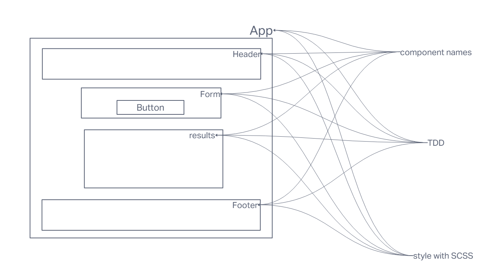

# LAB - Class 26/27/28/29

## Project: RESTy

### Author: Ike Steoger

### Problem Domain  

Today, we begin the first of a 4-Phase build of the RESTy application, written in React. In this first phase, our goal is to setup the basic scaffolding of the application, with intent being to add more functionality to the system as we go. This initial build sets up the file structure so that we can progressively build this application in a scalable manner.

### Links and Resources

- [GitHub Actions ci/cd](https://github.com/ikesteoger/resty/actions)
<!-- - [back-end server url](http://xyz.com) (when applicable)
- [front-end application](http://xyz.com) (when applicable) -->

### Collaborators

Ryan Gallaway  
Reece Renninger  
Kaedeon O'maera  
Ryan Eastman  
Nick Mullaney

### Setup

#### `.env` requirements (where applicable)

For now I have none and do not require one

#### How to initialize/run your application (where applicable)

- Run `npm i` and then `npm start` 

#### How to use your library (where applicable)

#### Features / Routes

- Currently a placeholder for REST website.
<!-- - GET : `/hello` - specific route to hit -->

#### Tests

- Run `npm test` to see tests running.

#### UML

